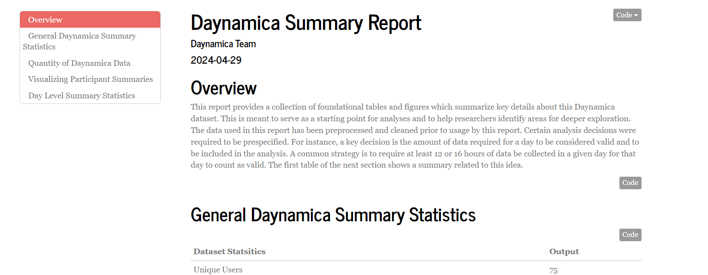
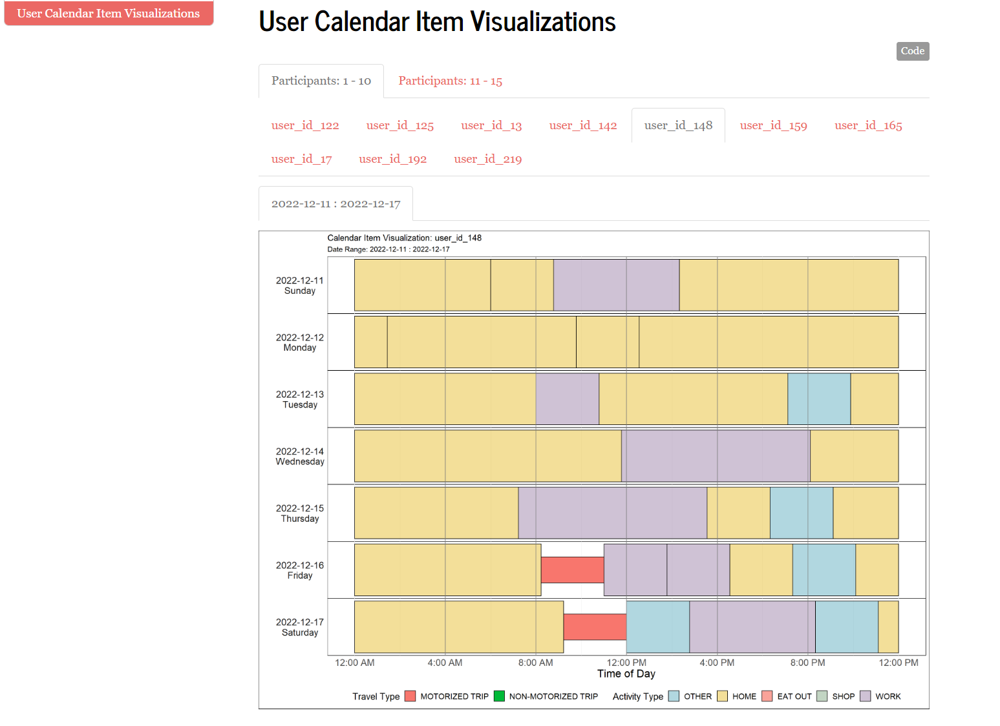
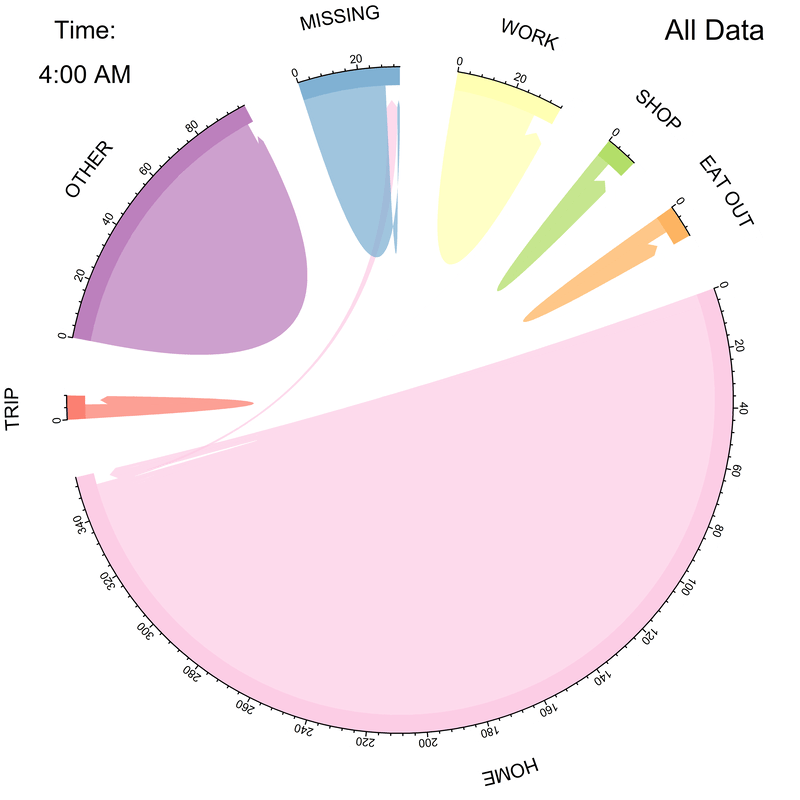
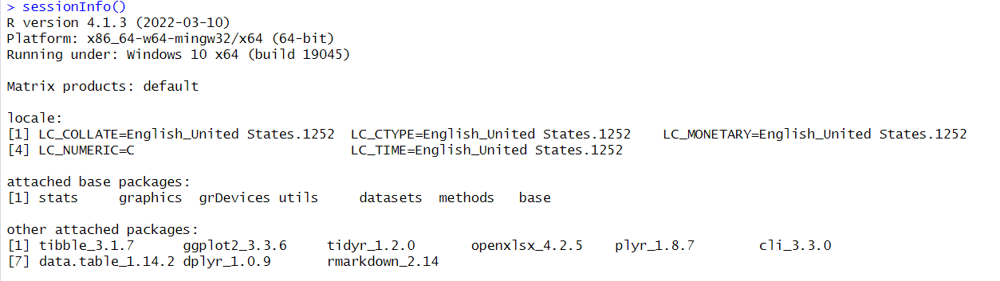

# Overview

An R repository for code related to standard analysis tools. Helps with summary statistics, standard tables, and common data visualization techniques.

This code repository contains a collection of functions to aid in the processing and analysis of Daynamica data. Alongside the analysis tools, an example dataset is also provided. These tools were developed to provide a wide range of functionality for manipulating Daynamica data while also making it as user-friendly as possible. 

For those who are experienced with using R, we strongly encourage you to dive into the code and see how you might customize the different functions to meet your exact needs. 

It is our hope to continually improve this code repo and add new modules to expand the list of options for analyzing Daynamica data. If you have a common set of analyses that you perform that isn't addressed in our repo, please let us know. We want to develop a thriving community of Dayanamica data users who can share and improve each others analysis. 

# Learn more about Daynamica

If you are interested in learning more about Daynamica and its history, we recommend reading this chapter from an upcoming book about Daynamica.

<a href="landing_page_files/Chapter 3. Digital Day Reconstruction 5.12.2024.pdf" target="_blank">Daynamica Book Chapter.</a>

## Getting Started

This section will focus on getting you started with the code repository. It will outline the overall structure of the repo as well as where to begin when analyzing Daynamica data. 

### Downloading the Code Repo

Downloading the repo is extremely straightforward. The repo may be downloaded by going to the "<> Code" button in green, and selecting the "Download ZIP" option. This will download a complete zip file of the repo which can be extracted and immediately used for data analysis. 

### Repository Organization

Within the code repository, there are a handful of key folders and files that we want to discuss. 

1. **master_analysis_file.R**: This file is the primary location of the analysis code. The code repository is structured with the master analysis file being the central element which calls upon different collections of code as needed. It contains documentation within itself on how to conduct different types of analyses. As new analysis modules are added to the repository, corresponding sections will be added to this document as well. This should be the first place to go whenever starting a new Daynamica data analysis. 

2. **data/**: This is where the Daynamica data is stored. Within this folder, analysts have freedom to organize files as they see fit though it is recommended too keep files from different studies within their own sub-directories. Within the master analysis file, the analyst specifies the location of the datasets.

3. **helper_functions/**: This is where the daynamica analysis code is stored. These code files can be universal to all daynamica analyses like data cleaning operations, or specific to different analysis modules. When performing standard analyses, this folder does not need to be modified. If the analyst wishes to customize the analysis from the default options, this folder is a good place to start.

4. **analysis_modules/**: For some analysis modules, the module's final output is a report. In these cases, the .RMD file which constructs the report is stored in this folder. For other modules which do not contain a report and are only a collection of functions, their code will be stored in **helper_functions/**.

5. **outputs/**: This is where the module outputs are stored. The specific location within this folder is specified within the master analysis file. Similar but different analyses may be created and stored within the different sub-directories within the outputs folder. For example, within outputs/, we can include a "Over 50 Y.O." and "50 and Under Y.O." analysis folders to allow us to perform age stratified analyses for quick comparison of sub-populations. 

### Running the code

Once the code repository has been downloaded, you may begin analysis immediately. For convenience, an anonymized dataset has been included by default in the code repo. This data exists in the data folder under *anonymized_data*.

The first step is to open *master_analysis_file.R*. This file automatically defaults to analyzing the anonymized dataset. The full master analysis file may be run from start to finish using this dataset and all modules will be run. Throughout this file there are contextual comments explaining what each step of the analysis is doing. 

### Adding your own dataset

When ready, you may add your own dataset under a new sub-direcotry within the *data/* directory. From there, you must modify the **Script / Data Import** Section of the master analysis file to tell the code where the new dataset is located. Additional updates should be made to the output location for each module so the results are sent to the proper location. 

## Code Organization

The repository is organized such that each module is a stand alone analysis that does not depend on another module. The majority of the relevant code is stored within *helper_functions/*. For code that is applicable across multiple modules (including planned modules), the R scripts are labeled with an *s* prefix (ie *s1_io_data.R* is used to import Daynamica data). Other R scripts are specific to a module and are not expected to be used in other modules. In these case, they are labeled with a *module_#* prefix, indicating that it is module specific along with which module it belongs to. 

The code repository is organized to be run through the master analysis file. Prior to any modules being run, a set of standard data processing tasks must be completed, regardless of the module. These tasks are performed at the beginning of *master_analysis_file.R*. Following those functions, each module is clearly indicated within *master_analysis_file.R* and may be run in any order. Some caution should be made when reordering modules as some modules require further data modification which may not work well with other modules. For example, Module 3 works best when the number of distinct activity and trip types is small (eg Trip, Home, Work, Other). The module has code to simplify the trip and activity subtypes. This may not be ideal for Module 1 where we want summary statistics on frequency of each activity and trip subtype.  

## Completed Modules

### Module 1: Standard Dayanmica Analysis Report

This module creates an HTML report with a series of tables and figures that are commonly used to summarize the Daynamica Calendar Items dataset. Examples of results include:
- General dataset statistics
- Data collected over time
- Total data collected
- User Calendar Item Visualization
- Activity / Trip count per day
- Trip Summary Statistics
- Activity Summary Statistics
- Primary Trip Mode Statistics
- Trip Purpose Statistics

The tables have the option to be exported as individual CSV files when generating the final report. Report figure outputs may be extracted by right clicking on the figures and selecting "Save image as".

Click on the report to see the full example report!

### Module 2: Robust Daynamica Calendar Item Visualization Report

This module is an extension of the User Calendar Item Visualization section from Module 1. It focuses only on visualizing calendar items with some additional control over the way the results are displayed including the coloring of the calendar item segments. 

The final output is an HTML report. 

Click on the report to see the full example report!

### Module 3: Chord Diagram Gif Generator

This module produces a collection of plots and a final GIF using a unique visualization format that highlights the movement patterns of the Daynamica data. See the example below of the gif made using the anonymized data provided alongside this code repository. 

## In Development Modules

### Module 4: Standard Sequence Alignment Daynamica Analysis Report

More to come on this soon!

### Module 5: Activity Chaining analyses

More to come on this soon!

### Module 6: Survey Analysis Tools

More to come on this soon!

# Disclaimer:

Daynamica data can be quite complex and there are a large number of moving parts when compiling a complete analysis. We have done our best to generate a standard workflow which will work with any standardized Daynamica dataset and fit the vast majority of use cases. That being said, we recognize that our repository is not foolproof and might not work for you. If that is the case, please let us know so we can continue to improve our codebase. 

## Package Version

Here is a screenshot of the R Environment and the version of common packages used in this code repo. 

# R Package:

In the future, we may convert this repo into an R package. This will make the distribution and sharing of the code base significantly easier and allow us to include better documentation. At this time, we are still working on developing the functionality of our repository but when appropriate, we may transition this repository into a stand alone R package. 

# Contribution Statement

Andrew Becker and Yaxuan Zhang developed this publicly available R code repository under the supervision of Yingling Fan and Ying Song using funding from the Humphrey School of Public Affairs at the University of Minnesota. 

**Module 1** was based on a Python prototype developed by Xiaohuan Zeng, Ying Song, and Yingling Fan to facilitate data analysis for the project *Centering the Margins: The Transportation Experience of Underserved Communities* ([Fan, et al., 2023](https://conservancy.umn.edu/handle/11299/257263)).

**Modules 2 and 3** were developed by Andrew Becker and Yingling Fan based on previous work from multiple Daynamica based research studies including:

1. *Smartphone-Based Interventions for Sustainable Travel Behavior: The University of Minnesota Parking Contract Holder Study* ([Fan, et al., 2020](https://conservancy.umn.edu/handle/11299/218025)); and

2. *COVID-19 Implications on Public Transportation: Understanding Post-Pandemic Transportation Needs, Behaviors, and Experiences* ([Fan, et al. 2022](https://conservancy.umn.edu/handle/11299/250147)).

